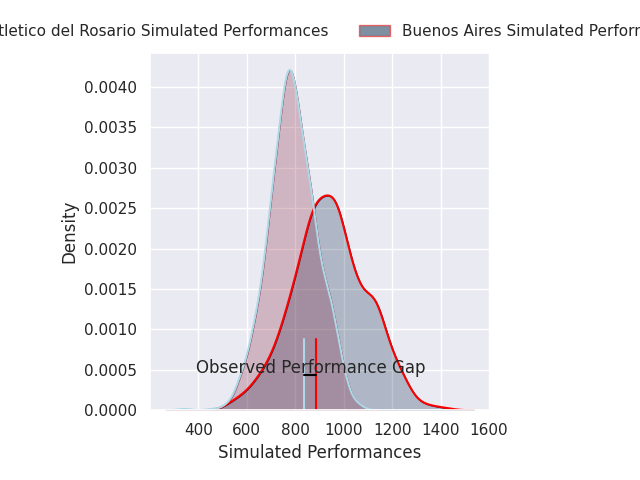
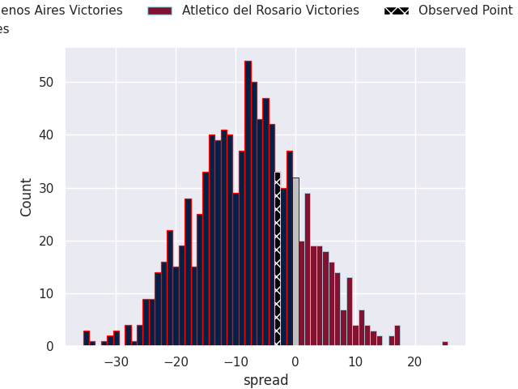

# Buenos Aires V Atlético del Rosario on 2026/08/29, 37.0 to 34.0

# Club Level Predictions

Now that the game has been played, lets see how the club predictions did. I predicted Buenos Aires to win by 15.95, and Buenos Aires won by 3.0. That's an absolute error of 13.0 for the margin of victory, while my average absolute error has been 15.0 over the past six months. This prediction was more accurate than 47.3% of my recent predictions.

For the Over/Under model, I predicted a total of 54.5 and we have an actual total of 71.0. That's an absolute error of 16.5 compared to a six month average of 14.4. This prediction was more accurate than 34.5% of my recent predictions.
## Projected Performances - Club Model

## Projected Spreads - Club Model

## Projected Results - Club Model

# Player Level Predictions

With the player model, I predicted Buenos Aires to win by 7.69,  and Buenos Aires won by 3.0. That's an absolute error of 4.7 for the margin of victory, while the average error as been 15.3 for the past six months. So this prediction was more accurate than 68.4% of my recent predictions.
## Projected Performances - Player Model

## Projected Spreads - Player Model

## Projected Results - Player Model

