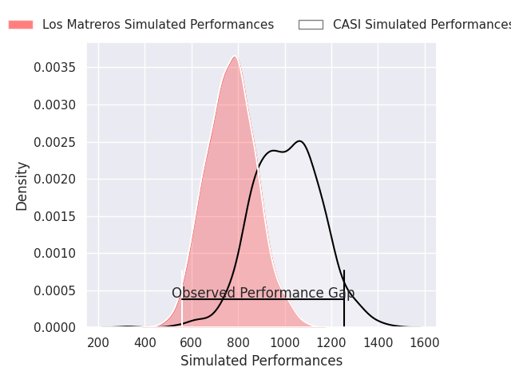
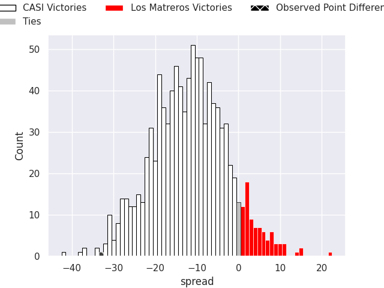
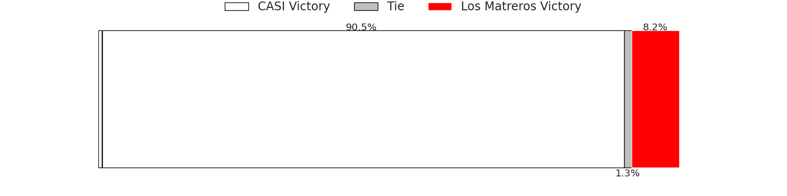

# CASI V Los Matreros on 2026/08/29, 50.0 to 17.0

# Club Level Predictions

Now that the game has been played, lets see how the club predictions did. I predicted CASI to win by 13.93, and CASI won by 33.0. That's an absolute error of 19.1 for the margin of victory, while my average absolute error has been 15.0 over the past six months. This prediction was more accurate than 29.4% of my recent predictions.

For the Over/Under model, I predicted a total of 59.5 and we have an actual total of 67.0. That's an absolute error of 7.5 compared to a six month average of 14.4. This prediction was more accurate than 65.5% of my recent predictions.
## Projected Performances - Club Model

## Projected Spreads - Club Model

## Projected Results - Club Model

# Player Level Predictions

With the player model, I predicted CASI to win by 11.9,  and CASI won by 33.0. That's an absolute error of 21.1 for the margin of victory, while the average error as been 15.3 for the past six months. So this prediction was more accurate than 22.0% of my recent predictions.
## Projected Performances - Player Model

## Projected Spreads - Player Model

## Projected Results - Player Model

