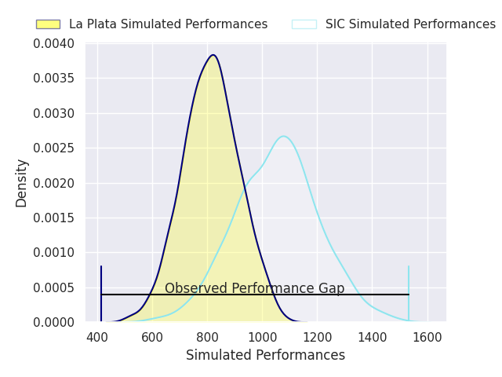
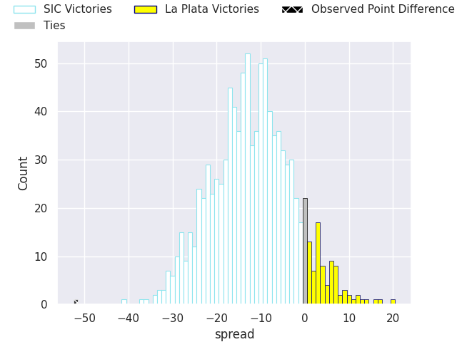
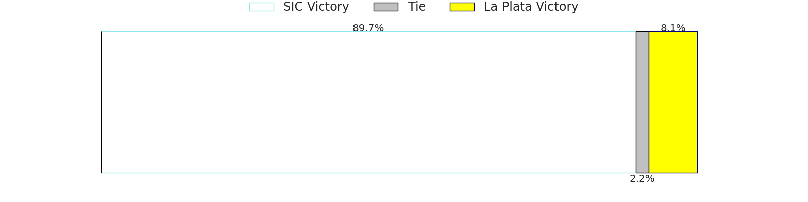

# SIC V La Plata on 2026/08/29, 71.0 to 19.0

# Club Level Predictions

Now that the game has been played, lets see how the club predictions did. I predicted SIC to win by 12.93, and SIC won by 52.0. That's an absolute error of 39.1 for the margin of victory, while my average absolute error has been 14.8 over the past six months. This prediction was more accurate than 5.4% of my recent predictions.

For the Over/Under model, I predicted a total of 51.5 and we have an actual total of 90.0. That's an absolute error of 38.5 compared to a six month average of 14.2. This prediction was more accurate than 3.0% of my recent predictions.
## Projected Performances - Club Model

## Projected Spreads - Club Model

## Projected Results - Club Model

# Player Level Predictions

With the player model, I predicted SIC to win by 12.0,  and SIC won by 52.0. That's an absolute error of 40.0 for the margin of victory, while the average error as been 15.1 for the past six months. So this prediction was more accurate than 4.2% of my recent predictions.
## Projected Performances - Player Model

## Projected Spreads - Player Model

## Projected Results - Player Model

