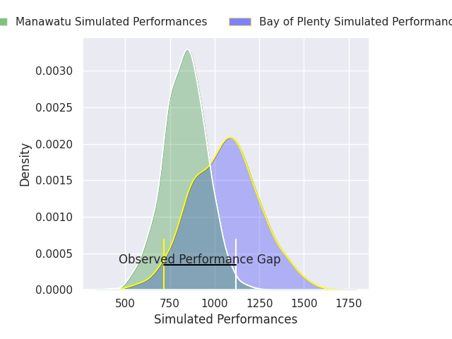
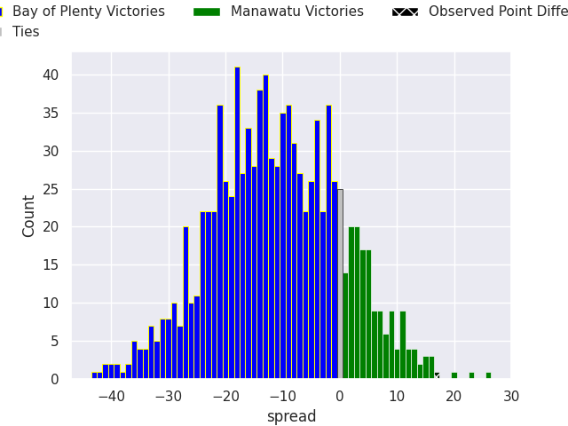

# Bay of Plenty V Manawatu on 2026/09/04, 12.0 to 29.0

# Club Level Predictions

Now that the game has been played, lets see how the club predictions did. I predicted Bay of Plenty to win by 19.08, and Manawatu won by 17.0. That's an absolute error of 36.1 for the margin of victory, while my average absolute error has been 14.9 over the past six months. This prediction was more accurate than 7.9% of my recent predictions.

For the Over/Under model, I predicted a total of 51.5 and we have an actual total of 41.0. That's an absolute error of 10.5 compared to a six month average of 14.4. This prediction was more accurate than 53.0% of my recent predictions.
## Projected Performances - Club Model

## Projected Spreads - Club Model

## Projected Results - Club Model

# Player Level Predictions

With the player model, I predicted Bay of Plenty to win by 11.15,  and Manawatu won by 17.0. That's an absolute error of 28.2 for the margin of victory, while the average error as been 15.3 for the past six months. So this prediction was more accurate than 13.2% of my recent predictions.
## Projected Performances - Player Model

## Projected Spreads - Player Model

## Projected Results - Player Model

