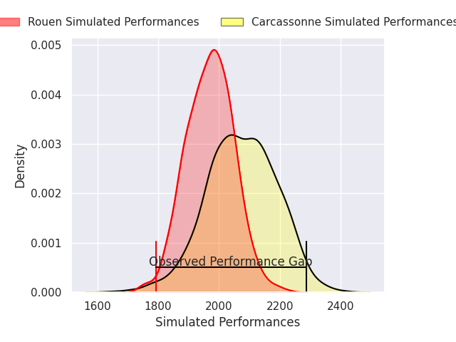
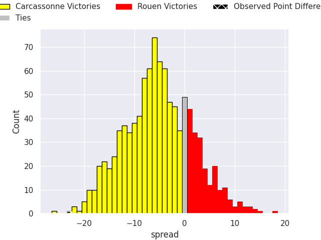
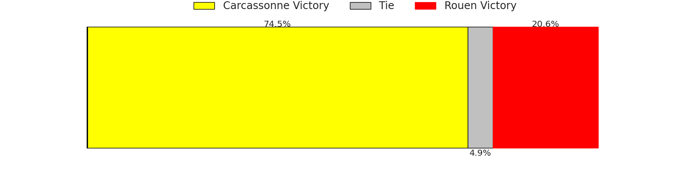

# Carcassonne V Rouen on 2026/09/04, 28.0 to 5.0

# Club Level Predictions

Now that the game has been played, lets see how the club predictions did. I predicted Carcassonne to win by 5.2, and Carcassonne won by 23.0. That's an absolute error of 17.8 for the margin of victory, while my average absolute error has been 14.9 over the past six months. This prediction was more accurate than 32.6% of my recent predictions.

For the Over/Under model, I predicted a total of 45.5 and we have an actual total of 33.0. That's an absolute error of 12.5 compared to a six month average of 14.4. This prediction was more accurate than 47.1% of my recent predictions.
## Projected Performances - Club Model

## Projected Spreads - Club Model

## Projected Results - Club Model

