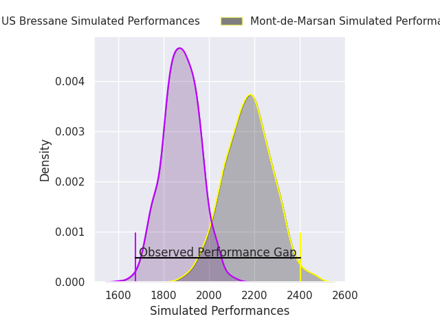
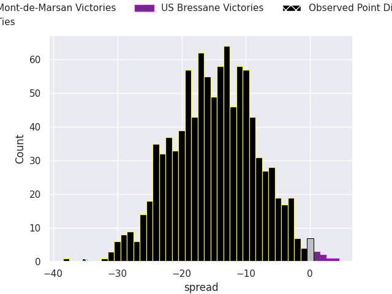

# Mont-de-Marsan V US Bressane on 2026/09/04, 42.0 to 7.0

# Club Level Predictions

Now that the game has been played, lets see how the club predictions did. I predicted Mont-de-Marsan to win by 14.81, and Mont-de-Marsan won by 35.0. That's an absolute error of 20.2 for the margin of victory, while my average absolute error has been 14.9 over the past six months. This prediction was more accurate than 27.1% of my recent predictions.

For the Over/Under model, I predicted a total of 43.5 and we have an actual total of 49.0. That's an absolute error of 5.5 compared to a six month average of 14.4. This prediction was more accurate than 75.1% of my recent predictions.
## Projected Performances - Club Model

## Projected Spreads - Club Model

## Projected Results - Club Model

