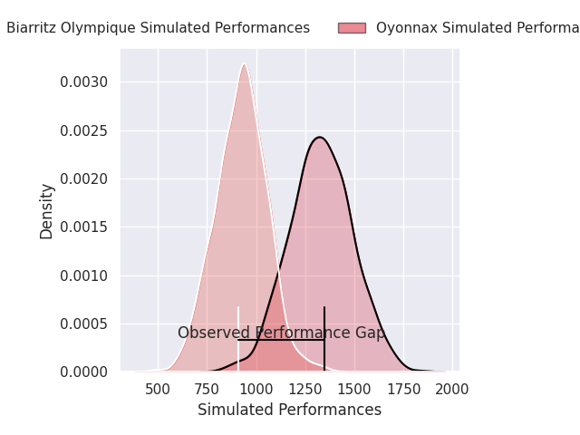
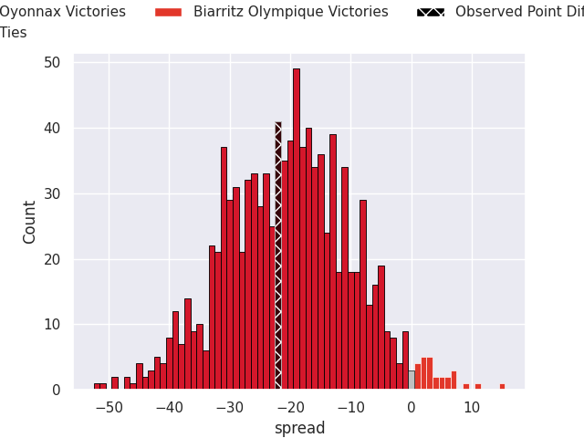
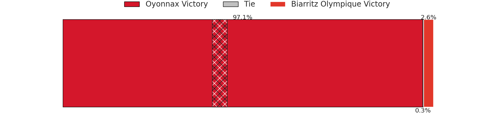

# Oyonnax V Biarritz Olympique on 2026/09/04, 47.0 to 25.0

# Club Level Predictions

Now that the game has been played, lets see how the club predictions did. I predicted Oyonnax to win by 15.45, and Oyonnax won by 22.0. That's an absolute error of 6.6 for the margin of victory, while my average absolute error has been 14.9 over the past six months. This prediction was more accurate than 70.0% of my recent predictions.

For the Over/Under model, I predicted a total of 48.5 and we have an actual total of 72.0. That's an absolute error of 23.5 compared to a six month average of 14.4. This prediction was more accurate than 19.9% of my recent predictions.
## Projected Performances - Club Model

## Projected Spreads - Club Model

## Projected Results - Club Model

# Player Level Predictions

With the player model, I predicted Oyonnax to win by 20.26,  and Oyonnax won by 22.0. That's an absolute error of 1.7 for the margin of victory, while the average error as been 15.3 for the past six months. So this prediction was more accurate than 78.1% of my recent predictions.
## Projected Performances - Player Model

## Projected Spreads - Player Model

## Projected Results - Player Model

