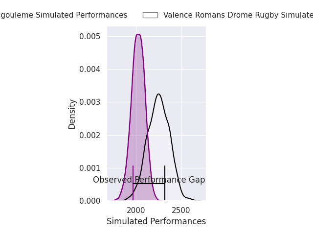
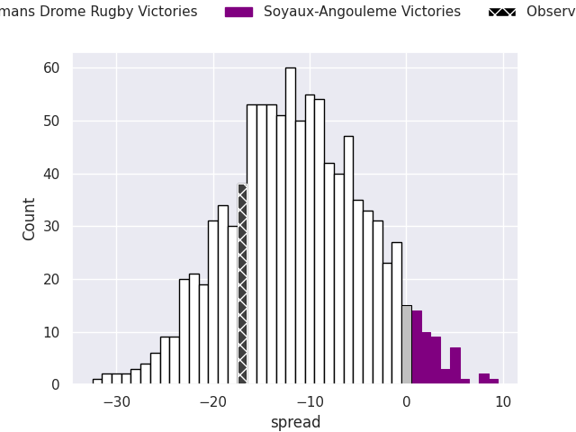
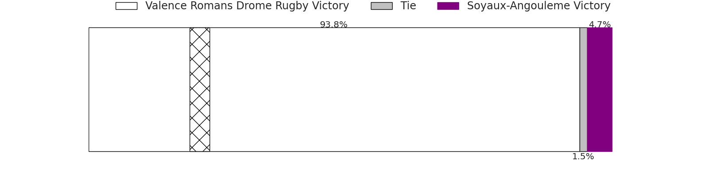
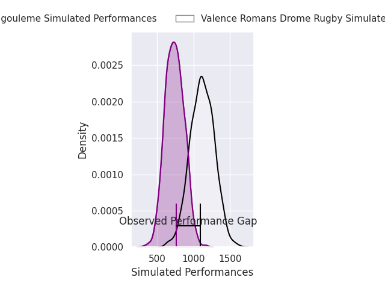
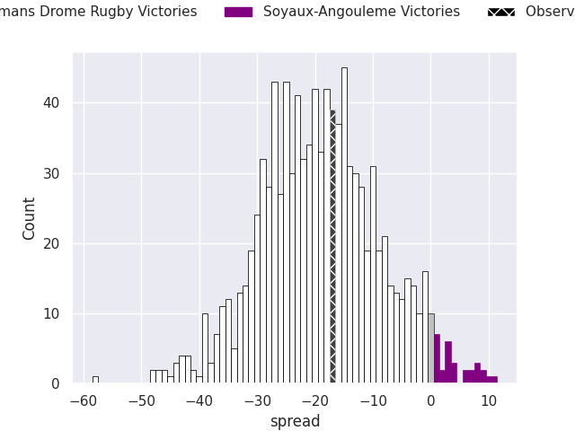
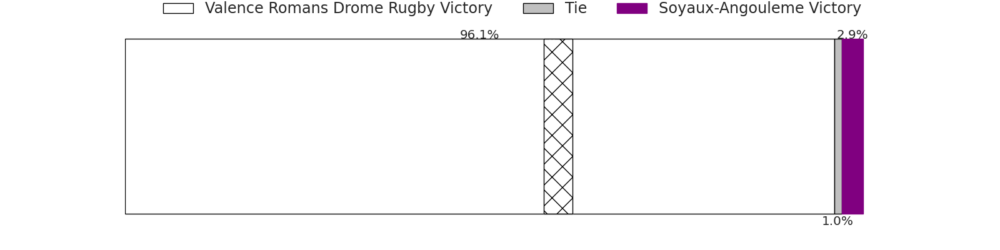

# Valence Romans Drome Rugby V Soyaux-Angouleme on 2026/09/04, 39.0 to 22.0

# Club Level Predictions

Now that the game has been played, lets see how the club predictions did. I predicted Valence Romans Drome Rugby to win by 11.36, and Valence Romans Drome Rugby won by 17.0. That's an absolute error of 5.6 for the margin of victory, while my average absolute error has been 14.9 over the past six months. This prediction was more accurate than 73.5% of my recent predictions.

For the Over/Under model, I predicted a total of 47.5 and we have an actual total of 61.0. That's an absolute error of 13.5 compared to a six month average of 14.4. This prediction was more accurate than 43.4% of my recent predictions.
## Projected Performances - Club Model

## Projected Spreads - Club Model

## Projected Results - Club Model

# Player Level Predictions

With the player model, I predicted Valence Romans Drome Rugby to win by 19.06,  and Valence Romans Drome Rugby won by 17.0. That's an absolute error of 2.1 for the margin of victory, while the average error as been 15.3 for the past six months. So this prediction was more accurate than 77.3% of my recent predictions.
## Projected Performances - Player Model

## Projected Spreads - Player Model

## Projected Results - Player Model

