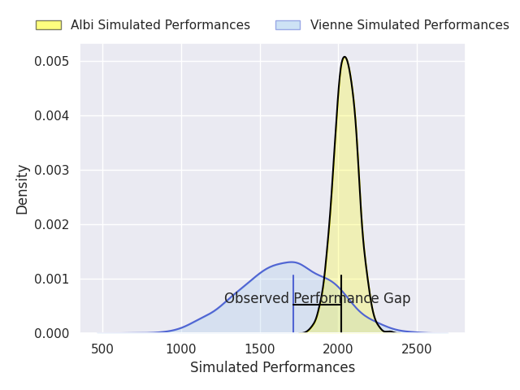
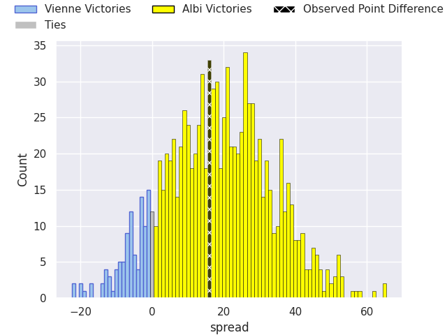
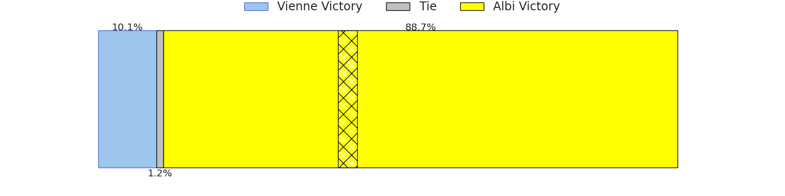

# Vienne V Albi on 2026/09/05, 13.0 to 29.0

# Club Level Predictions

Now that the game has been played, lets see how the club predictions did. I predicted Albi to win by 18.63, and Albi won by 16.0. That's an absolute error of 2.6 for the margin of victory, while my average absolute error has been 14.9 over the past six months. This prediction was more accurate than 86.7% of my recent predictions.

For the Over/Under model, I predicted a total of 43.5 and we have an actual total of 42.0. That's an absolute error of 1.5 compared to a six month average of 14.4. This prediction was more accurate than 93.9% of my recent predictions.
## Projected Performances - Club Model

## Projected Spreads - Club Model

## Projected Results - Club Model

