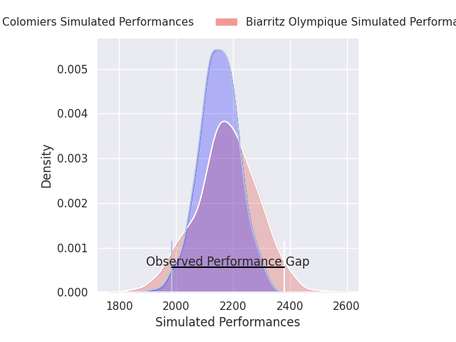
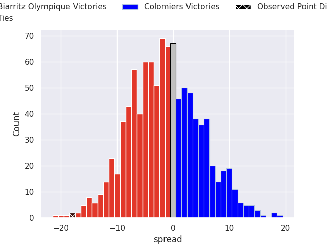
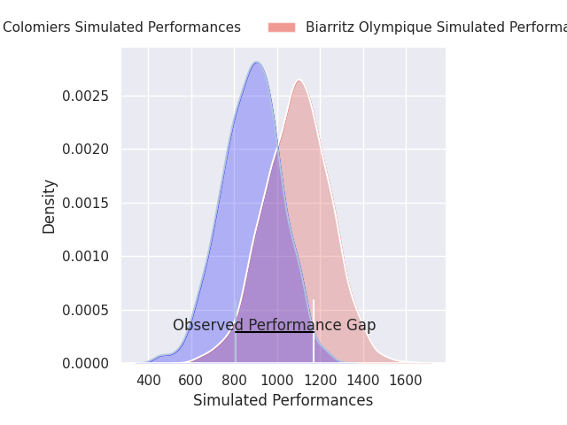
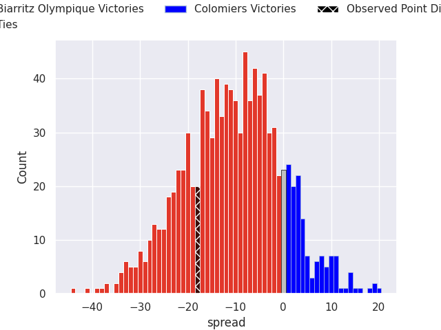
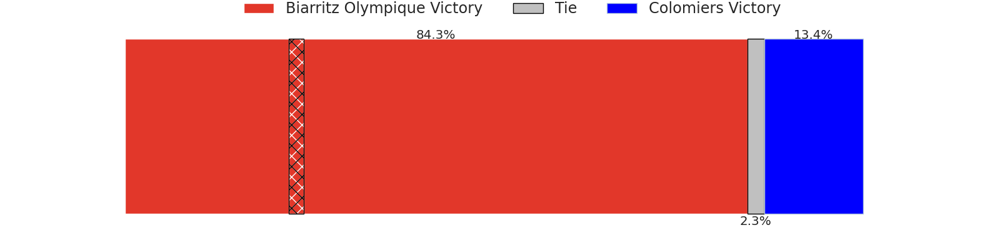

# Biarritz Olympique V Colomiers on 2026/09/10, 38.0 to 20.0

# Club Level Predictions

Now that the game has been played, lets see how the club predictions did. I predicted Biarritz Olympique to win by 1.44, and Biarritz Olympique won by 18.0. That's an absolute error of 16.6 for the margin of victory, while my average absolute error has been 14.8 over the past six months. This prediction was more accurate than 35.2% of my recent predictions.

For the Over/Under model, I predicted a total of 49.5 and we have an actual total of 58.0. That's an absolute error of 8.5 compared to a six month average of 14.4. This prediction was more accurate than 61.8% of my recent predictions.
## Projected Performances - Club Model

## Projected Spreads - Club Model

## Projected Results - Club Model

# Player Level Predictions

With the player model, I predicted Biarritz Olympique to win by 10.61,  and Biarritz Olympique won by 18.0. That's an absolute error of 7.4 for the margin of victory, while the average error as been 15.2 for the past six months. So this prediction was more accurate than 56.8% of my recent predictions.
## Projected Performances - Player Model

## Projected Spreads - Player Model

## Projected Results - Player Model

