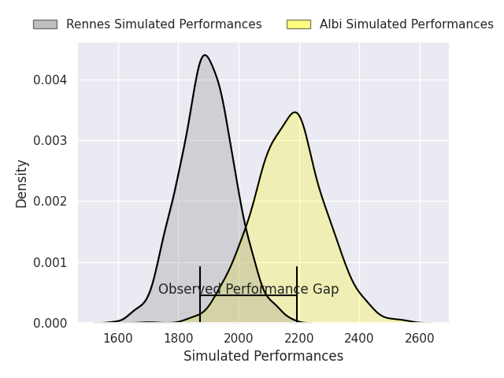
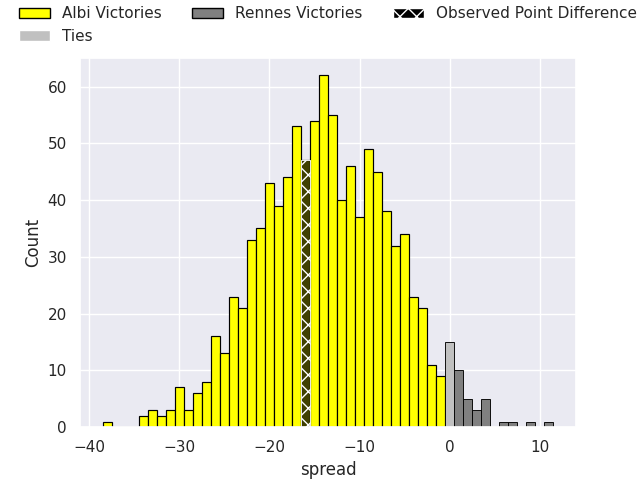
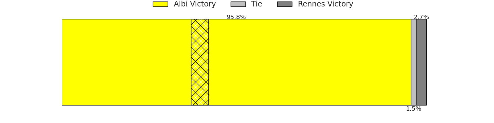

# Albi V Rennes on 2026/09/11, 38.0 to 22.0

# Club Level Predictions

Now that the game has been played, lets see how the club predictions did. I predicted Albi to win by 13.61, and Albi won by 16.0. That's an absolute error of 2.4 for the margin of victory, while my average absolute error has been 14.8 over the past six months. This prediction was more accurate than 88.6% of my recent predictions.

For the Over/Under model, I predicted a total of 38.5 and we have an actual total of 60.0. That's an absolute error of 21.5 compared to a six month average of 14.4. This prediction was more accurate than 23.1% of my recent predictions.
## Projected Performances - Club Model

## Projected Spreads - Club Model

## Projected Results - Club Model

