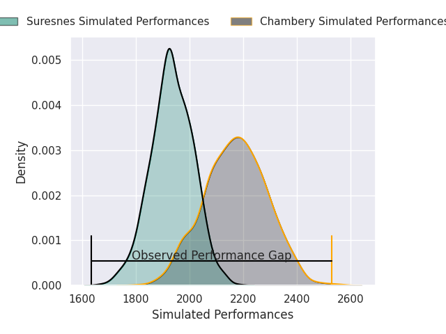
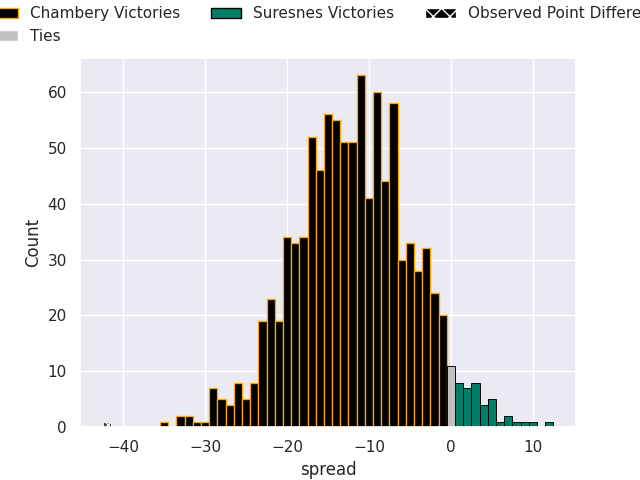

# Chambery V Suresnes on 2026/09/11, 49.0 to 7.0

# Club Level Predictions

Now that the game has been played, lets see how the club predictions did. I predicted Chambery to win by 11.84, and Chambery won by 42.0. That's an absolute error of 30.2 for the margin of victory, while my average absolute error has been 14.8 over the past six months. This prediction was more accurate than 11.6% of my recent predictions.

For the Over/Under model, I predicted a total of 46.5 and we have an actual total of 56.0. That's an absolute error of 9.5 compared to a six month average of 14.4. This prediction was more accurate than 57.1% of my recent predictions.
## Projected Performances - Club Model

## Projected Spreads - Club Model

## Projected Results - Club Model

