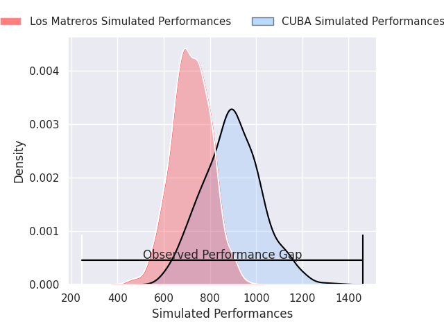
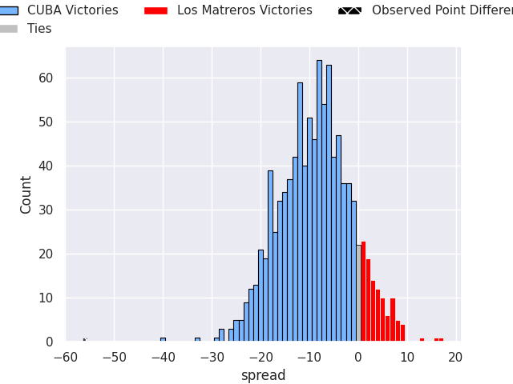
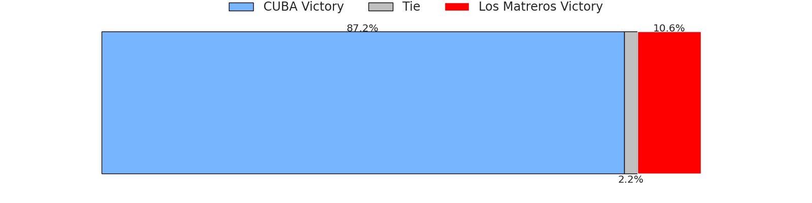

# CUBA V Los Matreros on 2026/09/12, 78.0 to 22.0

# Club Level Predictions

Now that the game has been played, lets see how the club predictions did. I predicted CUBA to win by 11.69, and CUBA won by 56.0. That's an absolute error of 44.3 for the margin of victory, while my average absolute error has been 14.8 over the past six months. This prediction was more accurate than 2.7% of my recent predictions.

For the Over/Under model, I predicted a total of 58.5 and we have an actual total of 100.0. That's an absolute error of 41.5 compared to a six month average of 14.4. This prediction was more accurate than 2.7% of my recent predictions.
## Projected Performances - Club Model

## Projected Spreads - Club Model

## Projected Results - Club Model

# Player Level Predictions

With the player model, I predicted CUBA to win by 8.77,  and CUBA won by 56.0. That's an absolute error of 47.2 for the margin of victory, while the average error as been 15.2 for the past six months. So this prediction was more accurate than 1.9% of my recent predictions.
## Projected Performances - Player Model

## Projected Spreads - Player Model

## Projected Results - Player Model

