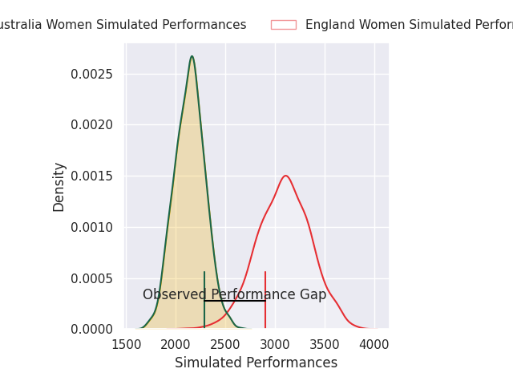
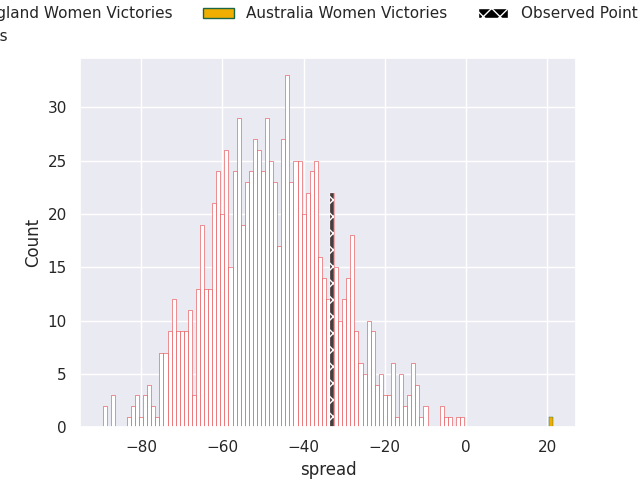
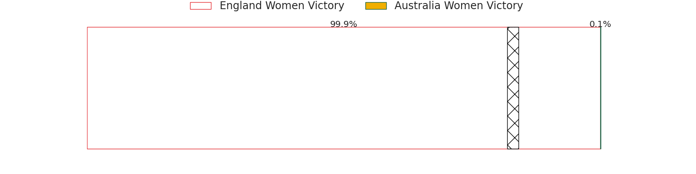

# England Women V Australia Women on 2026/09/12, 48.0 to 15.0

# Club Level Predictions

Now that the game has been played, lets see how the club predictions did. I predicted England Women to win by 47.47, and England Women won by 33.0. That's an absolute error of 14.5 for the margin of victory, while my average absolute error has been 14.8 over the past six months. This prediction was more accurate than 40.9% of my recent predictions.

For the Over/Under model, I predicted a total of 51.5 and we have an actual total of 63.0. That's an absolute error of 11.5 compared to a six month average of 14.4. This prediction was more accurate than 49.9% of my recent predictions.
## Projected Performances - Club Model

## Projected Spreads - Club Model

## Projected Results - Club Model

