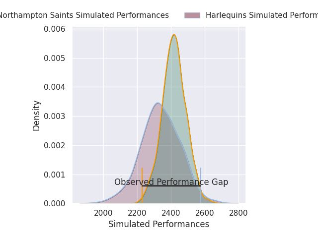
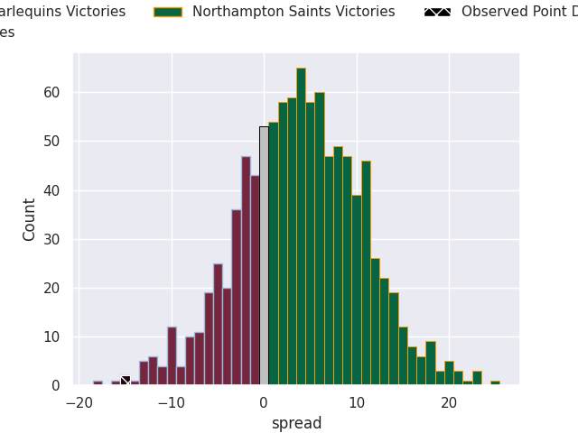
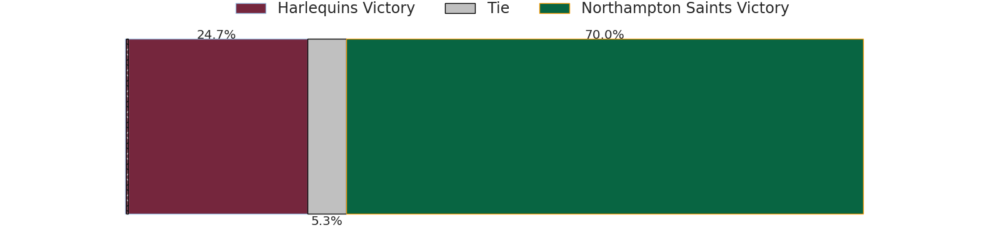
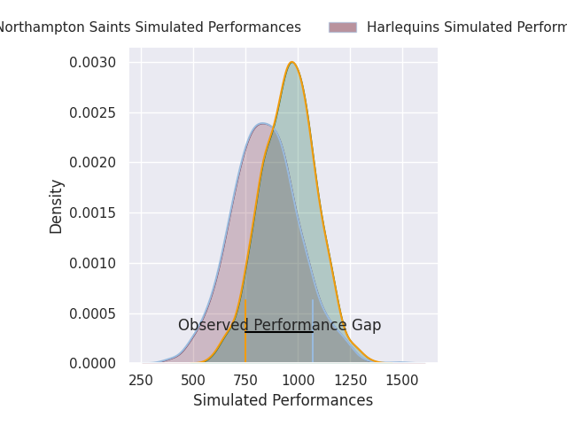
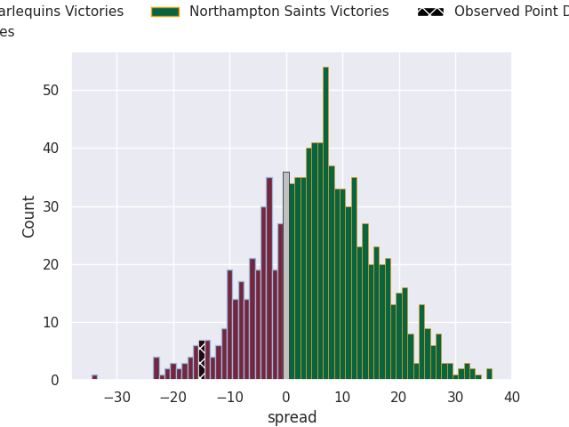
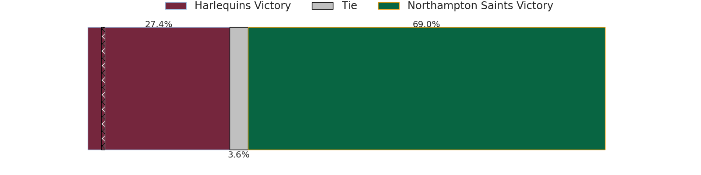

# Harlequins V Northampton Saints on 2026/09/12, 29.0 to 14.0

# Club Level Predictions

Now that the game has been played, lets see how the club predictions did. I predicted Northampton Saints to win by 3.93, and Harlequins won by 15.0. That's an absolute error of 18.9 for the margin of victory, while my average absolute error has been 14.8 over the past six months. This prediction was more accurate than 29.4% of my recent predictions.

For the Over/Under model, I predicted a total of 56.5 and we have an actual total of 43.0. That's an absolute error of 13.5 compared to a six month average of 14.4. This prediction was more accurate than 43.3% of my recent predictions.
## Projected Performances - Club Model

## Projected Spreads - Club Model

## Projected Results - Club Model

# Player Level Predictions

With the player model, I predicted Northampton Saints to win by 5.51,  and Harlequins won by 15.0. That's an absolute error of 20.5 for the margin of victory, while the average error as been 15.2 for the past six months. So this prediction was more accurate than 22.3% of my recent predictions.
## Projected Performances - Player Model

## Projected Spreads - Player Model

## Projected Results - Player Model

