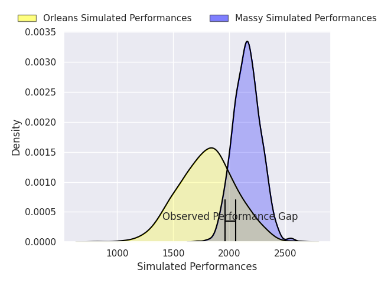
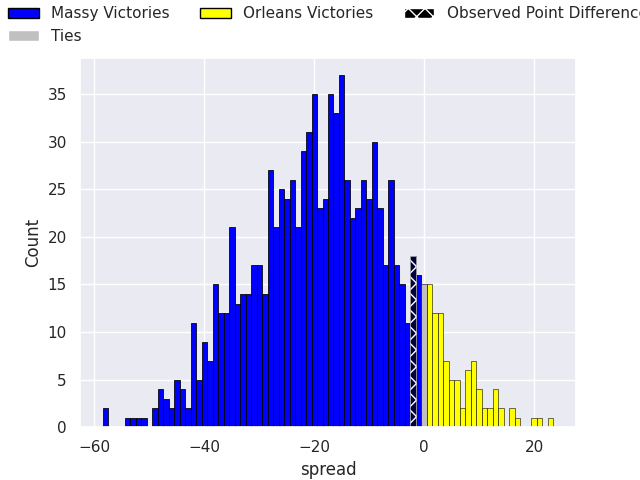
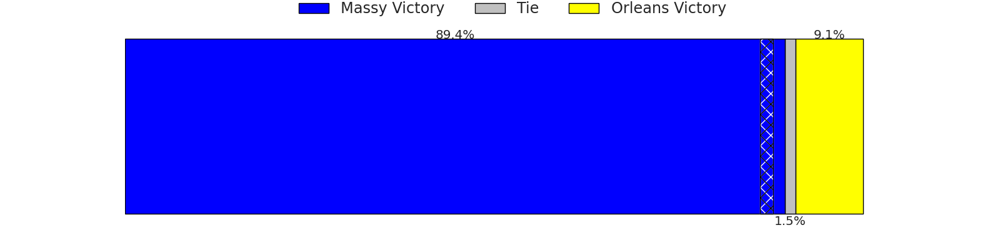

# Massy V Orleans on 2026/09/12, 31.0 to 29.0

# Club Level Predictions

Now that the game has been played, lets see how the club predictions did. I predicted Massy to win by 17.68, and Massy won by 2.0. That's an absolute error of 15.7 for the margin of victory, while my average absolute error has been 14.8 over the past six months. This prediction was more accurate than 37.4% of my recent predictions.

For the Over/Under model, I predicted a total of 45.5 and we have an actual total of 60.0. That's an absolute error of 14.5 compared to a six month average of 14.4. This prediction was more accurate than 40.3% of my recent predictions.
## Projected Performances - Club Model

## Projected Spreads - Club Model

## Projected Results - Club Model

