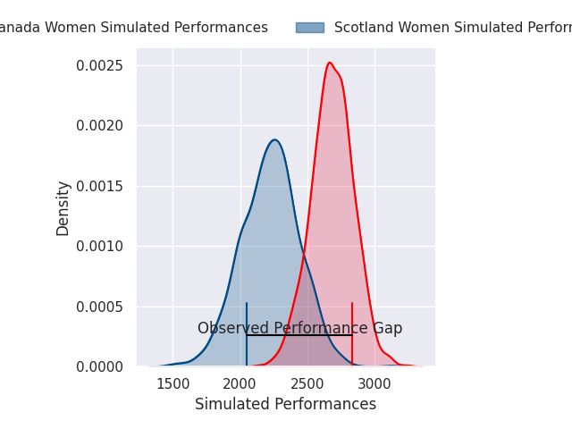
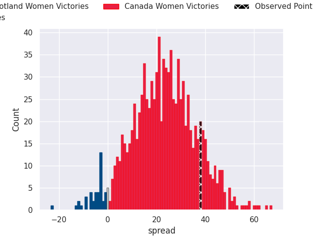
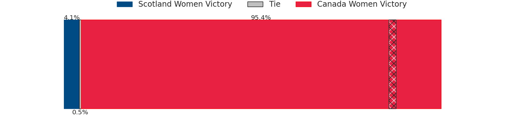

# Scotland Women V Canada Women on 2026/09/12, 26.0 to 64.0

# Club Level Predictions

Now that the game has been played, lets see how the club predictions did. I predicted Canada Women to win by 23.0, and Canada Women won by 38.0. That's an absolute error of 15.0 for the margin of victory, while my average absolute error has been 14.8 over the past six months. This prediction was more accurate than 39.7% of my recent predictions.

For the Over/Under model, I predicted a total of 48.5 and we have an actual total of 90.0. That's an absolute error of 41.5 compared to a six month average of 14.4. This prediction was more accurate than 2.7% of my recent predictions.
## Projected Performances - Club Model

## Projected Spreads - Club Model

## Projected Results - Club Model

