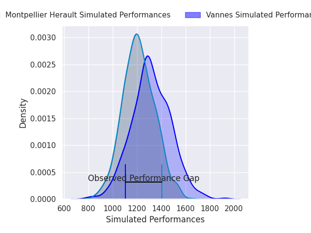
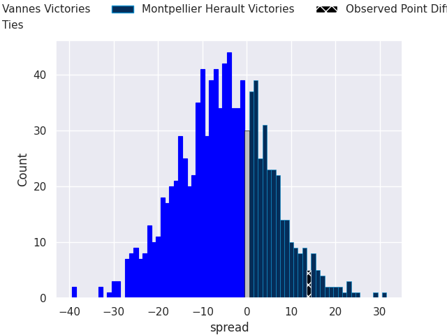
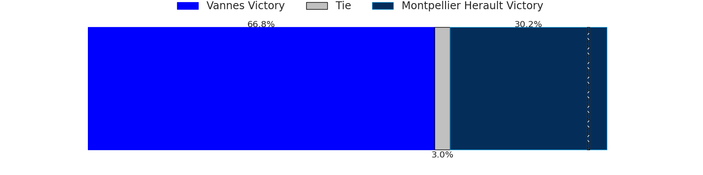

# Vannes V Montpellier Herault on 2026/09/12, 12.0 to 26.0

# Club Level Predictions

Now that the game has been played, lets see how the club predictions did. I predicted Vannes to win by 1.15, and Montpellier Herault won by 14.0. That's an absolute error of 15.2 for the margin of victory, while my average absolute error has been 14.8 over the past six months. This prediction was more accurate than 39.4% of my recent predictions.

For the Over/Under model, I predicted a total of 47.5 and we have an actual total of 38.0. That's an absolute error of 9.5 compared to a six month average of 14.4. This prediction was more accurate than 57.1% of my recent predictions.
## Projected Performances - Club Model

## Projected Spreads - Club Model

## Projected Results - Club Model

# Player Level Predictions

With the player model, I predicted Vannes to win by 5.06,  and Montpellier Herault won by 14.0. That's an absolute error of 19.1 for the margin of victory, while the average error as been 15.2 for the past six months. So this prediction was more accurate than 24.9% of my recent predictions.
## Projected Performances - Player Model

## Projected Spreads - Player Model

## Projected Results - Player Model

